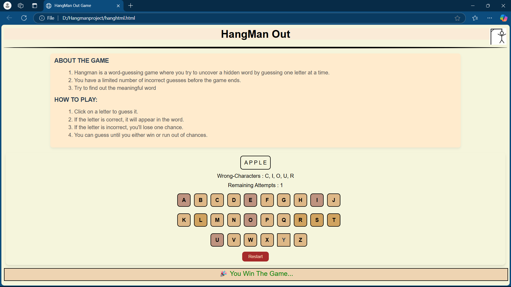
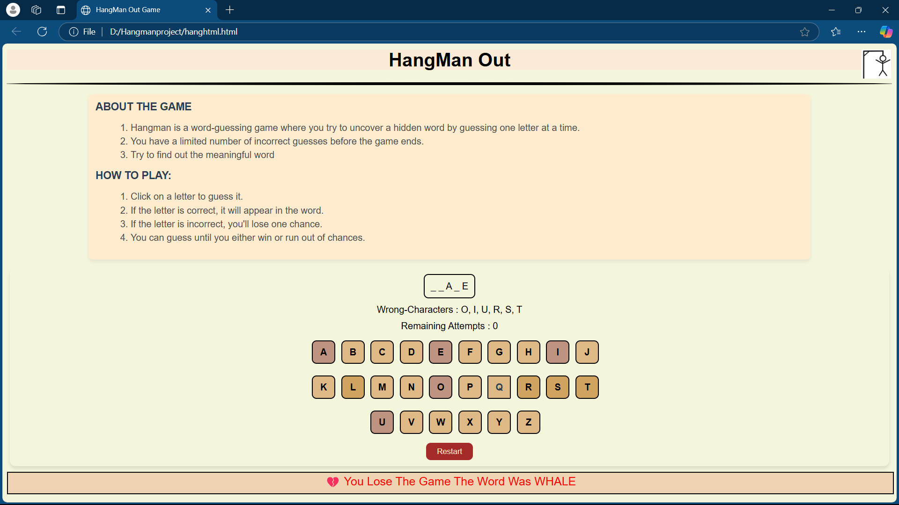

# 🕹️ Hangman Game

A simple and interactive Hangman game built using **HTML, CSS, and JavaScript**. Guess the word before you run out of attempts!

## 📸 Preview

### ✅ Game Won /


### ❌ Game Over


> 📌 *Images are stored in the `/assets/` directory. Adjust paths if stored elsewhere.*

## 🛠️ Features
- Classic hangman gameplay
- Responsive UI with modern styling
- Dynamic word selection
- Keyboard input handling
- Real-time updates on guessed letters and remaining attempts
- Win/Loss detection with reset option

## 🚀 Technologies Used
- HTML5
- CSS3
- JavaScript (ES6)

## 📁 Project Structure

hangman/
├── index.html
├── style.css
├── script.js
├── image/
│ ├── Screenshot1.png
│ ├── Screenshot2.png
└── README.md


## 🧠 How to Play
1. A hidden word is randomly selected.
2. Guess one letter at a time using your keyboard.
3. Correct guesses reveal the letter(s) in the word.
4. Incorrect guesses reduce your remaining chances.
5. Win by guessing the full word before your chances run out!

## 🖥️ Installation & Setup
To run the game locally:
```bash
git clone https://github.com/your-username/hangman-game.git
cd hangman-game
open index.html
📌 To-Do / Possible Improvements
Add difficulty levels

Include category selection

Store high scores using localStorage

Add animations and sound effects

👤 Author
Shivtej Sunil Gaikwad.
